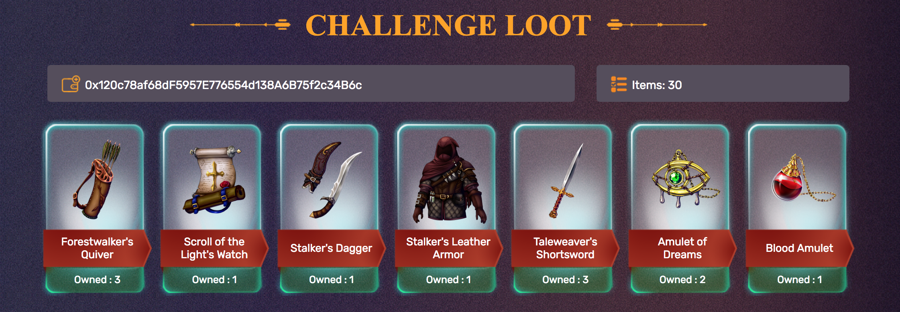

# Alto Cryptogame Challenge (ACC) Docs

This document is for developers looking to create cross-game interoperable items for [Alto Challenge Loot](https://loot.alto.io). 

For any questions, join the chat by clicking the button below.

[](https://gitter.im/cross-game-items?utm_source=badge&utm_medium=badge&utm_campaign=pr-badge&utm_content=badge)



Alto Cryptogame Challenge Loot are [ERC 721](http://erc721.org/) tokens on the Ethereum blockchain. They have smart contract functions that are explicitly design to enable a single item to be usable across several games.

## Quickstart Example

Run the example dApp found [here in the example directory](example). Instructions are found in the directory README.


## Geting Started

The steps below reference example code found in the [Quickstart Example](example).

#### 1. Initialize your web3 Provider

The web3 provider (like [Metamask](https://metamask.io/)) is used to interact with the smart contracts.

```
   // initialize web3
    if (typeof web3 !== 'undefined') {
      web3Provider = web3.currentProvider;
    } else {
      document.getElementById('mmwarning').textContent="Metamask not installed. Install the metamask chrome extension.";
      $('#mmwarning').effect("pulsate", 1000);
      $('.loader').hide();
    }

    web3 = new Web3(web3Provider);
```

#### 2. Access the contracts

ACC uses two smart contracts, [Ownership](example/contracts/Ownership) and [ItemManager](example/contracts/ItemManager).

`Ownership` is used to get the items owned by a user and the data associated with each item (its `Item Definition`).

`ItemManager` is used to get and set an item definition's `DNA`. The DNA is the data that's specific to a game (identified by a wallet address).


````

    var getItemDefinitions = (walletID) => new Promise((resolve, reject) => {
      ownershipInstance.itemDefsOf(walletID, async (err, result) => {
        if (err) return reject(err);
        return resolve(result);
      });
    });

    // use ownership smart contract to get owned items and item definitions
    $.getJSON('/contracts/Ownership.json', async function(data) {
      ownershipInstance = web3.eth.contract(data.abi).at(data.networks[networkID].address);

      itemDefinitionObjects = await getItemDefinitions(accWalletID);
      }
      
    var setDNA = (itemDefID, newDNA) => new Promise((resolve, reject) => {
      itemManagerInstance.setDNA(itemDefID, newDNA, (err, result) => {
        if (err) return reject(err);

        return resolve(result);
      });
    });
      
      
    // use the item manager smart contract to read and set item DNA
    $.getJSON('/contracts/ItemManager.json', function(data) {
      // Get the necessary contract artifact json file and instantiate it with truffle-contract
      itemManagerInstance = web3.eth.contract(data.abi).at(data.networks[networkID].address);
    });

    // bind set dna button
    $('#btn_setdna').click(function() {
      var itemDefID = $('.item-definitions').slick('slickCurrentSlide') + 1;
      var newDNA = $('#input_newdna').val();

      setDNA(itemDefID, newDNA);
    });
      
````
#### 3. Registering your game

The `ItemManager` functions `getDNA()` and `setDNA()` require a game's wallet address as lookup.

Currently we require developers to send us the wallet address they'll be using to call `setDNA()`, and these wallet addresses have to be given permission first by us (the contract creator).

Please reach out to [swen@alto.io](mailto://swen@alto.io) with your wallet address to be given permission. 

-----

## Further Reading


`Token`s minted through the ACC contracts are taken from `Item Definition`s created by developers. 

Developers can create the Item Definitions and set its properties, in the form of `DNA`, for in-game use. The `DNA` is simply a `uint256` and it is up to the developer to decide how to interpret that value. For example, the first 128 bits could represent an item's Durability and the other 128 can be further sub-divided to define other properties that its intended game might need.


Other developers can also define a `DNA` for an `Item Definition` that someone else created; that means those `DNA`s can have its own scheme of interpretation. Developers can opt to define their own `DNA` or simply use existing ones that others have created. In light of this, we highly encourage developers to share the scheme in which they designed their `DNA` to allow others the ability to interpret `DNA` for use in other games.

### Ownership and ItemManager Functions

1. `Ownership.itemDefsOf(address _game) public view returns (uint256[], uint256[])`
  - Fetches all item definitions created using `_game`
  - Returns two (2) uint256 arrays where the first array contains the item IDs and the second one contains the token IDs of each item definition
2. `ItemManager.setDNA(uint256 _itemId, uint256 _dna) public canAccess whenNotPaused`
  - Set the DNA of the item definition referenced by `_itemId`
  - `canAccess` modifier restricts calls to this method to registered wallet addresses only
  - A DNA is set using the combination of `msg.sender` and `_itemId` which allows for multiple DNA definitions to co-exist. This allows other games to fully support an existing item defined by other developers without completely relying on the DNA designed by the original developer.

3. `ItemManager.getDNA(uint256 _itemId, address _game) public view returns (uint256)`
  - Fetches the DNA of an item definition, `_itemId`, defined by a developer, `_game`
  - There is no access restriction when fetching DNA. For as long as you know the wallet address that a game developer used, you may opt to read the DNA they set.

The example below is excuted within a truffle connection to Rinkeby network. Notice that we avoided using `artifacts.require` to get contract instances and used `web3.eth.contract` to be more generic.

```
// because the contract is compiled using truffle
var OwnershipJSON = require('../build/contracts/Ownership.json'),
    ItemManagerJSON = require('../build/contracts/ItemManager.json'),

    Ownership = web3.eth.contract(OwnershipJSON.abi),
    ItemManager = web3.eth.contract(ItemManagerJSON.abi),

    // you can also get the relevant addresses from OwnershipJSON.networks / ItemManagerJSON.networks
    ownInstance = Ownership.at(<insert_ownership_address>),
    imInstance = ItemManager.at(<insert_item_manager_address>),

    accWallet = "0x0", // replace with actual wallet address

    itemDNAs = {};

// Get all items defined for ACC
module.exports = async (callback) => {
  ownInstance.itemDefsOf(accWallet, async (err, itemDefs) => {
    console.log(itemDefs);

    // Have to wrap in a promise manually because of HDWalletProvider limitations
    var getDNA = (itemId, wallet) => new Promise((resolve, reject) => {
      imInstance.getDNA(itemId, wallet, (err, result) => {
        if (err) return reject(err);

        return resolve(result);
      });
    });

    // get all DNAs for each item definition
    // ..remember that itemDefs[0] is the list of all item definition IDs; NOT token IDs
    for (var i = 0; i < itemDefs[0].length; i++) {
      try {
        // we are fetching the DNA defined by `accWallet`
        itemDNAs[itemDefs[0][i]] = await getDNA(itemDefs[0][i], accWallet);
      } catch (e) {
        console.log(e);
      }
    }

    console.log(itemDNAs);
  });
};
```
