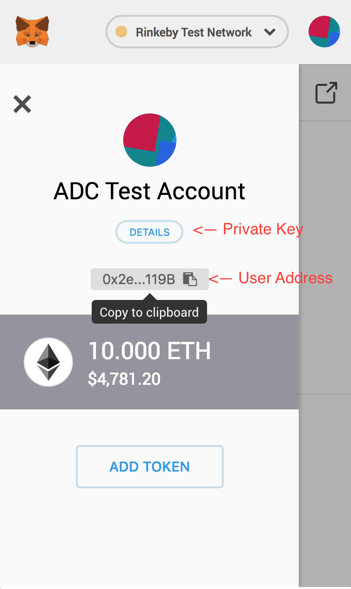
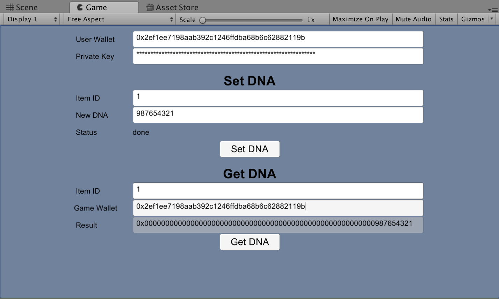

# Alto Cryptogame Challenge Unity Example

This is an example Unity App using the items created in the [Alto Cryptogame Challenge](https://loot.alto.io). 

For any questions, join the chat by clicking the button below.

**[Before you begin] It's recommended that you run through the [web-based example first](../example). That example shows the user flow with a more mature web3 UX implementation via Metamask.**

## Getting Started with the Unity Example

1.  Install [Metamask](https://metamask.io/) on your browser, set up your wallet and [get some test ETH](https://www.rinkeby.io/#faucet).
2.  Purchase some Alto Cryptogame Challenge Loot from  the [rinkeby-loot.alto.io sandbox](https://rinkeby-loot.alto.io/).
3. Checkout the project directory. 
4. Import the project into Unity.

	**Security Note: The next step will require you to import your wallet ID and private key into Unity. Never share your private key online. Use a test wallet when developing.**

5. Since we don't have a Metamask interface for Unity, we have to manually input user addresses and private keys. Copy them from Metamask.

	

6. Input the address and private key unto the fields. If the user address and private key is valid, you should be able to call the `SetDNA` and `GetDNA` functions.

The `SetDNA` function will require permission, but the `GetDNA` function can be called from any address.

**Note: If Set DNA does not work, make sure your wallet address has been given permission. [More info here](..).**

### App Screenshot
