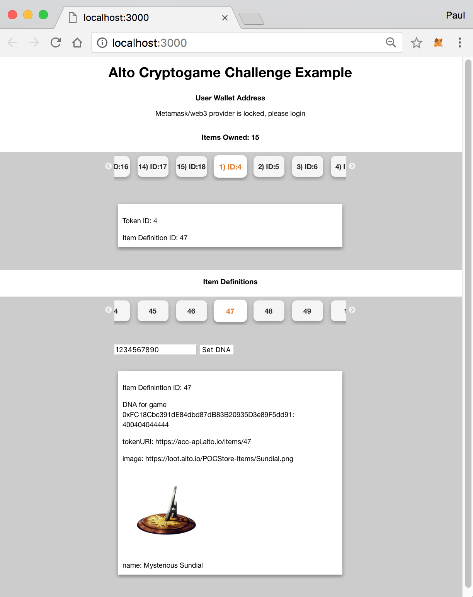

# Alto Cryptogame Challenge Example

This is an example dApp using the items created in the [Alto Cryptogame Challenge](https://loot.alto.io). 

For any questions, join the chat by clicking the button below.

[](https://gitter.im/cross-game-items?utm_source=badge&utm_medium=badge&utm_campaign=pr-badge&utm_content=badge)

## Getting Started

1.  Install [Metamask](https://metamask.io/) on your browser, set up your wallet and [get some test ETH](https://www.rinkeby.io/#faucet).
2.  Purchase some Alto Cryptogame Challenge Loot from  the [rinkeby-loot.alto.io sandbox](https://rinkeby-loot.alto.io/).
3. Checkout the project directory. 
4. Install [Node and npm](https://nodejs.org/en/).
5. Run lite-server inside the project directory --

	```
	npm install -g lite-server
	lite-server
	```
6. The app should be automatically open at [http://localhost:3000](http://localhost:3000).

**Note: If Set DNA does not work, make sure your wallet address has been given permission. [More info here](..).**

### App Screenshot
